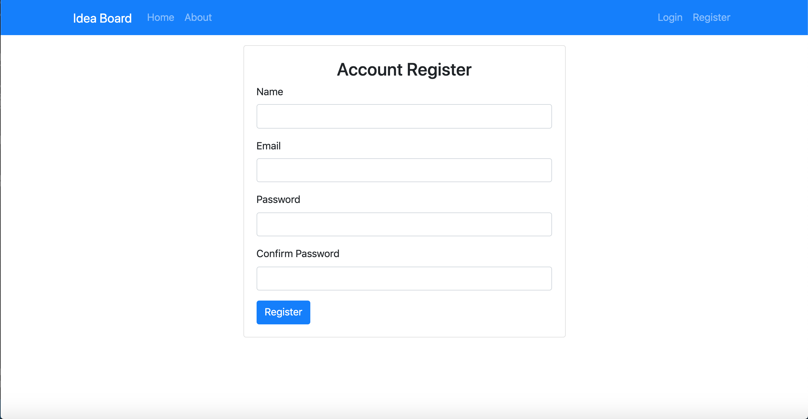

# idea-board

This is a CRUD app that allows you to keep track of your creative ideas in one place before they get away from you! Simply log in to see the list of ideas you've made. You can edit or delete any ideas, and of course add new ones. Works well on both desktop and mobile!

This app runs on Node,
routes are done with Express,
database/ORM is MongoDB and Mongoose,
authentication is handled with Passport,
passwords are hashed using bcrypt,
template engine is handlebars,
UI is done with bootstrap.

### Check out the app yourself here!!

[Idea Board](https://idea-board-2018.herokuapp.com/)

## Screenshots

## Authors

Gray Atkinson-Adams

I built this app as part of a Udemy course by Brad Traversy--Traversy Media
(Node.js, Express & MongoDB Dev to Deployment)

## License

[MIT](https://choosealicense.com/licenses/mit/)
